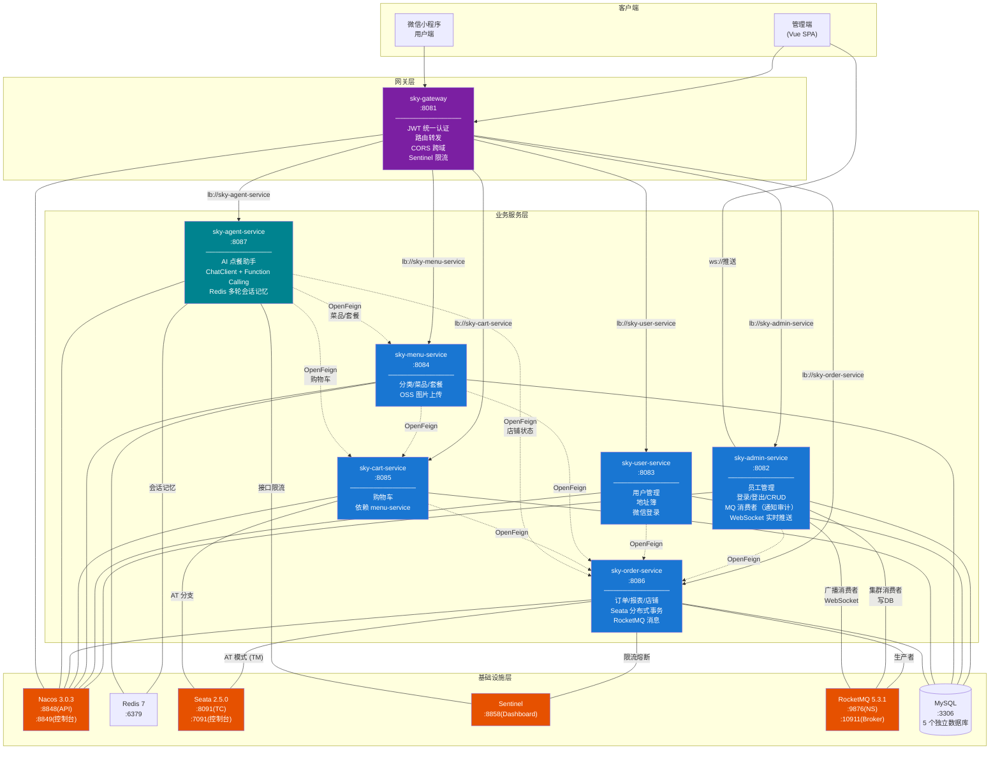
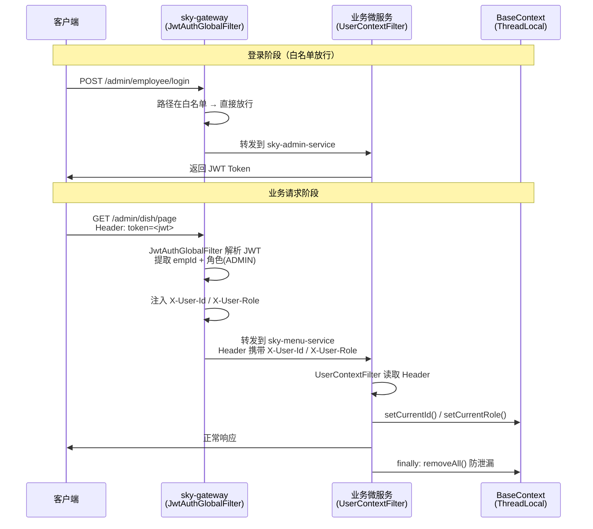

# 苍穹外卖

基于 Spring Boot + Spring Cloud Alibaba 的微服务外卖点餐系统，包含管理后台、微信小程序用户端与 AI 智能点餐助手。

## 项目简介

苍穹外卖是一套完整的外卖点餐系统，采用**前后端分离 + 微服务架构**。后端提供 RESTful API，同时服务于管理端（商家管理）和用户端（微信小程序）。项目由 Spring Boot 2.7.3 单体架构升级至 Spring Boot 3.5.0 微服务架构，引入 Nacos 注册/配置中心、Gateway 网关、Sentinel 流控熔断、Seata 分布式事务、RocketMQ 消息队列等云原生技术栈，并基于 Spring AI 实现了支持 Function Calling 与多轮会话记忆的智能点餐助手。

## 技术栈

> 已升级至 Spring Boot 3.x（原 Spring Boot 2.7.3），`javax.*` → `jakarta.*`，要求 JDK 17+。

### 后端

| 分类 | 技术 | 版本 |
|------|------|------|
| **运行时** | JDK 17（Jakarta EE namespace） | 17+ |
| **核心框架** | Spring Boot | 3.5.0 |
| **微服务治理** | Spring Cloud / Spring Cloud Alibaba | 2025.0.0 / 2025.0.0.0 |
| **注册 & 配置** | Nacos（认证已开启） | 3.0.3 |
| **API 网关** | Spring Cloud Gateway（WebFlux/Netty） | — |
| **流控 & 熔断** | Sentinel | 1.8.9 |
| **分布式事务** | Seata（AT 模式） | 2.5.0 |
| **消息队列** | RocketMQ | 5.3.1 |
| **持久层** | MyBatis + PageHelper | 3.0.5 / 2.1.1 |
| **数据库** | MySQL | 5.7+ |
| **缓存** | Redis（Lettuce） | 7.x |
| **连接池** | Druid（`druid-spring-boot-3-starter`） | 1.2.23 |
| **认证** | JWT（jjwt） | 0.12.6 |
| **对象存储** | 阿里云 OSS | 3.17.4 |
| **支付** | 微信支付（测试阶段为模拟实现） | — |
| **AI** | Spring AI（ChatClient + Function Calling，OpenAI 兼容接口） | 1.1.2 |
| **工具库** | Lombok、Fastjson、Apache POI | 1.18.38 / 2.0.53 / 5.2.5 |

## 微服务架构



### 数据流说明

```
请求流：客户端 → sky-gateway(JWT校验) → 注入 X-User-Id/X-User-Role → 路由到目标微服务 → UserContextFilter 读取上下文 → 业务处理
调用流：sky-order-service ──OpenFeign──→ sky-user-service（用户/地址）
                          ──OpenFeign──→ sky-menu-service（菜品/套餐）
                          ──OpenFeign──→ sky-cart-service（购物车）
事务流：sky-order-service ──@GlobalTransactional──→ Seata TC ──协调──→ sky_order_db + sky_cart_db 两个参与库的 undo_log 自动回滚
消息流：订单状态变更 → RocketMQProducerService(asyncSend) → Topic: order-notification(5种Tag) → ┬ RocketMQConsumerService(集群) → order_notification审计表
                                                                                                                                 └ RocketMQWebSocketConsumer(广播) → WebSocket推送商家端
AI 流：客户端 → sky-gateway(JWT) → sky-agent-service（ChatClient + Function Calling）→ OrderingTools（ToolContext 传 userId）─OpenFeign─→ menu/cart/order-service
```

## 项目结构

```
sky-take-out
├── sky-common                公共模块（工具类/常量/异常/JWT属性/OSS属性/全局异常处理器）
├── sky-pojo                 数据对象模块（DTO/Entity/VO，按 5 个限界上下文拆分子包）
├── sky-feign-common         OpenFeign 公共配置（FeignConfig/FeignInterceptor/FeignErrorDecoder）
├── sky-admin-service         员工管理微服务（:8082，数据库 sky_admin_db）
├── sky-user-service          用户管理微服务（:8083，数据库 sky_user_db）
├── sky-menu-service          菜单管理微服务（:8084，数据库 sky_menu_db，含 Redis 缓存）
├── sky-cart-service          购物车微服务（:8085，数据库 sky_cart_db，依赖 menu-service）
├── sky-order-service         订单核心微服务（:8086，数据库 sky_order_db，依赖所有服务）
├── sky-agent-service         AI 点餐助手微服务（:8087，无数据库，Spring AI + Redis 会话记忆）
├── sky-gateway               网关（WebFlux/Netty，JWT 认证 + 路由 + CORS + 限流）
├── nacos_config_example/     Nacos 配置模板（12 份 YAML + 5 份 Sentinel 规则 JSON）
├── docker/                   Docker 构建资源（Seata 配置/Sentinel Dashboard Dockefile）
├── .sql/                     数据库脚本（Nacos/Seata 建库 + 5 个微服务数据库）
└── docker-compose.yml        容器编排（14 容器一键部署）
```

### 微服务模块对照表

| 模块 | 端口 | 数据库 | 职责 | 依赖关系 |
|------|:----:|--------|------|----------|
| `sky-gateway` | 8081 | — | API 网关，JWT 认证 + 路由 + 限流 | — |
| `sky-admin-service` | 8082 | `sky_admin_db` | 员工登录/CRUD/状态管理 + MQ 消费者（通知审计） | — |
| `sky-user-service` | 8083 | `sky_user_db` | 用户管理 + 地址簿 + 微信登录 | — |
| `sky-menu-service` | 8084 | `sky_menu_db` | 分类/菜品/套餐管理 + OSS 上传 | Redis |
| `sky-cart-service` | 8085 | `sky_cart_db` | 购物车 | menu-service（Feign） |
| `sky-order-service` | 8086 | `sky_order_db` | 订单/报表/店铺 + Seata + MQ | 所有其他服务（Feign） |
| `sky-agent-service` | 8087 | —（无 DB） | AI 点餐助手：菜单查询/加购减购 + 多轮记忆 | menu/cart/order（Feign）、Redis |

## 功能特性

### 管理端功能

| 模块 | 功能 |
|------|------|
| **员工管理** | 登录/登出、增删改查、分页查询、状态启停 |
| **分类管理** | 菜品 & 套餐分类的增删改查 |
| **菜品管理** | 菜品 CRUD、起售停售、口味管理、分页查询 |
| **套餐管理** | 套餐 CRUD、起售停售、套餐菜品关联、分页查询 |
| **订单管理** | 订单查询/统计/导出、状态流转（接单/拒单/取消/派送/完成） |
| **数据统计** | 营业额统计、用户统计、订单统计、销量 Top10 排名 |
| **工作台** | 今日概览、订单/菜品/套餐总览 |
| **通用接口** | 文件上传（阿里云 OSS）、店铺营业状态管理 |

### 用户端功能

| 模块 | 功能 |
|------|------|
| **微信登录** | 基于微信小程序的用户登录认证 |
| **浏览菜单** | 分类浏览、菜品列表、套餐列表 |
| **购物车** | 添加/删除/清空购物车 |
| **下单支付** | 提交订单、微信支付（测试阶段为模拟实现） |
| **订单管理** | 历史订单、订单详情、取消订单、再来一单、催单 |
| **地址管理** | 收货地址的增删改查 |

### AI 智能点餐助手（sky-agent-service）

基于 Spring AI `ChatClient` + Function Calling 的对话式点餐助手：

| 特性 | 说明 |
|------|------|
| **两种接入方式** | 同步 `POST /user/agent/chat` + SSE 流式 `POST /user/agent/chat/stream` |
| **8 个工具** | 营业状态 / 分类 / 菜品 / 套餐 / 购物车查看与加减清空 |
| **权限边界** | 刻意不提供下单/支付/地址工具，System Prompt 引导用户前往结算页完成下单 |
| **多轮会话记忆** | Redis List 存储对话历史，滑动窗口 20 条 + TTL 7 天，服务重启后记忆仍在 |
| **防幻觉校验** | 加购前先经 Feign 校验商品 id 存在性，LLM 编造 id 时返回引导性错误促其自纠 |
| **全链路身份传递** | Gateway 注入 `X-User-Id` → ToolContext → BaseContext → FeignInterceptor 透传下游 |

> LLM 通过 OpenAI 兼容接口接入，模型/API-Key 在 Nacos 的 `spring.ai.openai.*` 中配置。

### 流控与熔断（Sentinel）

| 层级 | 策略 | 说明 |
|------|------|------|
| **网关层** | 全局 100 QPS 限流 | 超限返回 HTTP 429 + `Result{code:0, msg:"系统繁忙，请稍后再试"}` |
| **服务层** | 7 个核心写接口各 5 QPS | `submitOrder`/`payOrder`/`userCancelOrder`/`confirmOrder`/`rejectOrder`/`adminCancelOrder`/`completeOrder` |
| **AI 助手层** | `agentChat`/`agentChatStream` 各 5 QPS | 超限降级返回提示语（SSE 返回 Flux 单条），规则持久化于 `sky-agent-service-flow-rules.json` |
| **熔断** | 慢调用(RT>300ms) + 异常比例(>50%) | 双策略，窗口 10s，minRequestAmount=5 |
| **规则持久化** | JSON 规则存储在 Nacos | Dashboard 重启不丢失 |

### 分布式事务（Seata AT 模式）

- **自动代理**：SCA 2025 + Seata 2.5.0 自动代理 DataSource，无需手动配置 `DataSourceProxy`
- **回滚机制**：`sky_order_db`、`sky_cart_db` 均创建 `undo_log`，异常时 TC 协调自动回滚
- **事务边界**：`@GlobalTransactional` 标注在 `OrderTransactionService.submitOrderInTransaction()` / `paymentInTransaction()`；地址查询、地图校验、购物车查询在事务外完成
- **事务参与者**：order-service 写 `orders/order_detail`，cart-service 写 `shopping_cart`（`clean()` 带本地事务）
- **MQ 时机**：全局事务成功返回后才发送 RocketMQ 通知，避免回滚后仍发消息
- **降级策略**：Seata Server 不可用时自动降级为本地事务

### 消息队列（RocketMQ）

- **架构**：`sky-order-service`（生产者）→ RocketMQ Broker → `sky-admin-service`（两个消费者组）
- **Topic/Tag 设计**：单一 Topic `order-notification`，5 种 Tag 区分事件类型
  - `order-submit`（type=3）：新订单通知
  - `payment-success`（type=1）：支付成功，提醒接单
  - `order-cancel`（type=4）：订单取消（用户/商家/管理员）
  - `order-complete`（type=5）：订单完成
  - `reminder`（type=2）：用户催单
- **消息体**：统一用 `OrderNotificationMessage` DTO（`sky-pojo` 的 `com.sky.dto.mq`）
- **异步发送**：`asyncSend` + `SendCallback`，不阻塞主流程
- **双消费者组**：
  - `sky-admin-consumer-group`（集群模式）：幂等消费，写入 `order_notification` 审计表
  - `admin-ws-broadcast-group`（广播模式）：推送给所有 admin-service 实例的 WebSocket 客户端
- **幂等消费**：集群消费者通过 `order_notification` 表 `msg_id` 唯一索引实现幂等
- **WebSocket 实时推送**：广播消费者接收消息后，通过 JSR 356 `@ServerEndpoint` 推送到商家端浏览器

## 快速开始

### 环境要求

- **JDK 17+**（JDK 24 不兼容 Lombok）
- **Maven 3.6+**
- **MySQL 5.7+**（Windows 原生服务，root/123456）
- **Docker Desktop**

### 一、Docker Compose 一键部署（推荐）

```bash
# 1. 初始化数据库（首次执行）
mysql -u root -p < .sql/nacos-mysql.sql          # Nacos 配置库
mysql -u root -p < .sql/seata-server.sql          # Seata 事务库
mysql -u root -p < .sql/split/00-run-all.sql      # 5 个微服务数据库

# 2. 编译打包
mvn package -DskipTests

# 3. 启动所有容器（14 个）
docker compose up -d --build

# 4. 查看状态
docker compose ps

# 5. 查看日志
docker compose logs -f sky-order-service

# 6. 停止
docker compose down
```

### 二、Nacos 初始化

Nacos 3.x 已开启认证，控制台独立端口 **8849**。首次部署需初始化管理员：

```bash
docker compose up -d nacos
# Nacos 3.x 使用 v3 端点（v1 已废弃）
curl -X POST 'http://localhost:8848/nacos/v3/auth/user/admin' -d 'password=SkyNacos@2026'
```

访问控制台 **`http://localhost:8849/index.html`**，使用 `nacos` / `SkyNacos@2026` 登录，导入 17 份配置模板（位于 `nacos_config_example/`）：

| Data ID | 格式 | 用途 |
|---------|:----:|------|
| `sky-admin-service-dev.yaml` | YAML | Admin 服务本地开发 |
| `sky-admin-service-docker.yaml` | YAML | Admin 服务 Docker 部署 |
| `sky-agent-service-dev.yaml` | YAML | Agent 服务本地开发（含 `spring.ai.openai.*`） |
| `sky-agent-service-docker.yaml` | YAML | Agent 服务 Docker 部署 |
| `sky-user-service-dev.yaml` | YAML | User 服务本地开发 |
| `sky-user-service-docker.yaml` | YAML | User 服务 Docker 部署 |
| `sky-menu-service-dev.yaml` | YAML | Menu 服务本地开发 |
| `sky-menu-service-docker.yaml` | YAML | Menu 服务 Docker 部署 |
| `sky-cart-service-dev.yaml` | YAML | Cart 服务本地开发 |
| `sky-cart-service-docker.yaml` | YAML | Cart 服务 Docker 部署 |
| `sky-order-service-dev.yaml` | YAML | Order 服务本地开发 |
| `sky-order-service-docker.yaml` | YAML | Order 服务 Docker 部署 |
| `sky-agent-service-flow-rules.json` | JSON | AI 助手接口 Sentinel 流控规则 |
| `sky-order-service-flow-rules.json` | JSON | Order 接口 Sentinel 流控规则 |
| `sky-order-service-degrade-rules.json` | JSON | Order 接口 Sentinel 熔断规则 |
| `sky-gateway-api-group.json` | JSON | 网关全局限流 API 分组（`/admin/**`、`/user/**`、`/notify/**`） |
| `sky-gateway-flow-rules.json` | JSON | 网关全局 100 QPS 流控规则（resourceMode=1，关联 API 分组） |

> 敏感字段使用 `${ENV_VAR:默认值}` 占位符，真实值存储在 gitignored 的 `.env` 文件中，容器启动时通过环境变量注入。配置持久化在 MySQL `nacos_config` 库，容器重建不丢失。

### 三、本地开发模式

```bash
# 1. 启动基础设施
docker compose up -d nacos redis seata namesrv broker sentinel

# 2. 加载环境变量（本地开发不会自动读取 .env）
# Linux/macOS
set -a; source .env; set +a
# Windows Git Bash: 需 export 必要变量
export NACOS_PASSWORD=SkyNacos@2026

# 3. 逐个启动微服务
mvn -pl sky-admin-service spring-boot:run   # :8082
mvn -pl sky-user-service spring-boot:run    # :8083
mvn -pl sky-menu-service spring-boot:run    # :8084
mvn -pl sky-cart-service spring-boot:run    # :8085
mvn -pl sky-order-service spring-boot:run   # :8086
mvn -pl sky-agent-service spring-boot:run   # :8087（需先在 Nacos 配好 spring.ai.openai.* 的 API Key）
mvn -pl sky-gateway spring-boot:run         # :8081
```

> **Windows 用户注意**：Windows 原生 JDK 默认 GBK 编码，Nacos 的 UTF-8 YAML 会解析失败，启动前需设置：
> ```bash
> export JAVA_TOOL_OPTIONS="-Dfile.encoding=UTF-8 -Dsun.jnu.encoding=UTF-8"
> ```

## 基础设施

### 端口与凭据

| 服务 | 端口 | 凭据 |
|------|------|------|
| Nacos | `:8848`（API/gRPC 9848/9849），控制台 `:8849`（容器 8080） | `nacos` / `SkyNacos@2026` |
| Redis | `:6379` | 密码 `123456` |
| Seata | `:8091`（TC）、`:7091`（控制台） | 控制台 `seata` / `seata` |
| Sentinel Dashboard | `:8858` | `sentinel` / `sentinel` |
| RocketMQ | NameServer `:9876`、Broker `:10911`（VIP 10909） | — |
| RocketMQ Console | `:8082`（容器 8080） | — |
| MySQL | `:3306`（Windows 原生服务） | root / `123456` |
| sky-gateway | `:8081` | — |
| sky-admin-service | `:8092` → 容器 `:8082` | — |
| sky-user-service | `:8083` | — |
| sky-menu-service | `:8084` | — |
| sky-cart-service | `:8085` | — |
| sky-order-service | `:8086` | — |
| sky-agent-service | `:8087` | — |

> **端口说明**：`sky-admin-service` 宿主机端口使用 `8092`，因为 `8082` 被 RocketMQ Console 占用。

### 数据库拆分

| 数据库 | 表 | 所属服务 |
|--------|-----|----------|
| `sky_admin_db` | `employee`、`order_notification` | sky-admin-service |
| `sky_user_db` | `user`、`address_book` | sky-user-service |
| `sky_menu_db` | `category`、`dish`、`dish_flavor`、`setmeal`、`setmeal_dish` | sky-menu-service |
| `sky_cart_db` | `shopping_cart` | sky-cart-service |
| `sky_order_db` | `orders`、`order_detail`、`undo_log` | sky-order-service |

## API 接口

### 管理端 API（/admin）

| 模块 | 路径前缀 | 说明 |
|------|----------|------|
| 员工管理 | `/admin/employee` | 登录、增删改查 |
| 分类管理 | `/admin/category` | 分类 CRUD |
| 菜品管理 | `/admin/dish` | 菜品 CRUD |
| 套餐管理 | `/admin/setmeal` | 套餐 CRUD |
| 订单管理 | `/admin/order` | 订单查询、状态流转 |
| 数据报表 | `/admin/report` | 营业额/用户/订单统计、销量排名 |
| 工作台 | `/admin/workspace` | 今日概览 |
| 店铺管理 | `/admin/shop` | 店铺营业状态 |
| 通用接口 | `/admin/common` | OSS 文件上传 |

### 用户端 API（/user）

| 模块 | 路径前缀 | 说明 |
|------|----------|------|
| 登录 | `/user/user/login` | 微信登录 |
| 分类浏览 | `/user/category` | 分类列表 |
| 菜品浏览 | `/user/dish` | 菜品列表 |
| 套餐浏览 | `/user/setmeal` | 套餐列表 |
| 购物车 | `/user/shoppingCart` | 购物车操作 |
| 订单 | `/user/order` | 下单、支付、查询 |
| 地址簿 | `/user/addressBook` | 地址管理 |
| 店铺 | `/user/shop/status` | 店铺营业状态 |
| AI 助手 | `/user/agent/chat`<br/>`/user/agent/chat/stream` | 智能点餐对话（同步 / SSE 流式） |

## 认证流程



- **Token 提取规则**：Admin 端从 Header `token` 读取，User 端从 Header `authentication` 读取
- **白名单路径**（免认证）：`/admin/employee/login`、`/user/user/login`、`/user/shop/status`
- **密钥管理**：JWT 密钥使用 `SHA-256(原始密钥)` 作为 HMAC 密钥，在 Nacos 配置中统一管理
- **跨服务传递**：OpenFeign 调用时 `FeignInterceptor` 自动从 `RequestContextHolder` 获取当前请求的 `X-User-Id`/`X-User-Role` 并注入 Feign 请求头

## 关键设计

### 统一返回格式

```json
{
  "code": 1,
  "msg": "success",
  "data": {}
}
```

- `code=1` 表示成功，`code=0` 表示失败
- `PageResult` 扩展分页字段 `total`、`records`
- Sentinel 流控/熔断响应也保持相同结构

### 双端 Controller 结构

每个微服务的 Controller 分为两个子包：

- `controller/admin/` — 管理端接口（商家后台）
- `controller/user/` — 用户端接口（微信小程序）

两个包中可能存在同名 Controller（如 `ShopController`），通过 `@RestController("beanName")` 显式命名避免 Bean 冲突。

### 支付模拟

`OrderServiceImpl.payment()` 为测试友好的实现，直接构造 `ORDERPAID` 伪响应后调用 `OrderTransactionService.paymentInTransaction()` 更新订单状态，**不调用微信支付 API**；全局事务成功返回后再发送支付成功 MQ。上线前需替换为真实的 `WeChatPayUtil` 调用。

## 注意事项

### 依赖版本管理

Spring Cloud / Spring Cloud Alibaba 及其传递依赖的版本由 BOM 统一管理，**不要在子模块 POM 中指定版本号**：

- Spring Boot `3.5.0`（父 POM）
- `org.springframework.cloud:spring-cloud-dependencies:2025.0.0`
- `com.alibaba.cloud:spring-cloud-alibaba-dependencies:2025.0.0.0`

### 组件扫描

所有微服务启动类必须加 `@ComponentScan(basePackages = "com.sky")`，否则 `sky-common` 中的 `GlobalExceptionHandler` 无法被扫描到，业务异常将直接返回 500。

### Gateway 依赖

Gateway 模块必须显式声明以下依赖（不会自动传递）：

- `spring-cloud-starter-loadbalancer` — 否则 `lb://` 路由失效
- `spring-cloud-alibaba-sentinel-gateway` — 否则网关限流编译失败
- **禁止**依赖 `spring-boot-starter-web`（Tomcat） — Gateway 基于 WebFlux/Netty

### 数据库密码

`EmployeeServiceImpl` 对登录密码做 MD5 比对，数据库 `employee` 表必须存储 MD5 哈希值（`MD5("123456") = e10adc3949ba59abbe56e057f20f883e`），不能存明文。

### Windows 编码

Windows 原生 JDK 17 默认 GBK 编码，运行 Maven 或 Spring Boot 前必须设置 `JAVA_TOOL_OPTIONS="-Dfile.encoding=UTF-8 -Dsun.jnu.encoding=UTF-8"`。Linux / WSL / macOS 无需此步骤。

### 启动顺序

```
Nacos → MySQL → Seata → sky-order-service → 其他业务服务 → sky-gateway
```

Docker Compose 已通过 `depends_on` + `healthcheck` 编排好启动依赖，无需手动控制。

## 开源协议

本项目基于 [MIT License](LICENSE) 开源。
