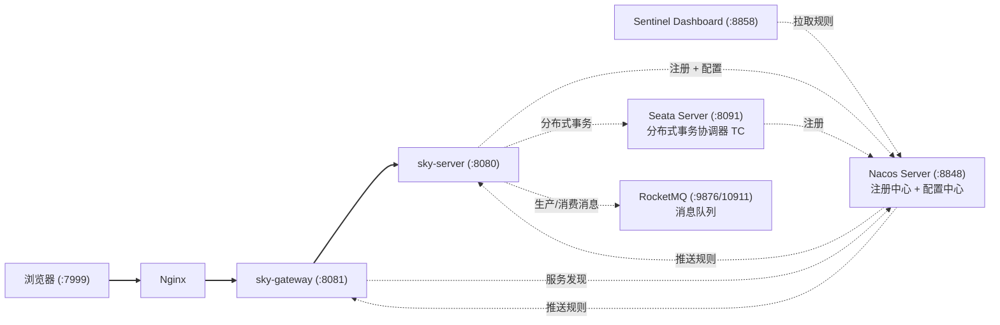

一个基于 Spring Boot + Spring Cloud Alibaba 的外卖点餐系统，包含管理端和用户端，支持微信小程序点餐、微信支付等功能。

## 项目简介

苍穹外卖是一个完整的外卖点餐系统，采用前后端分离 + 微服务架构。后端提供 RESTful API，支持管理端（商家管理后台）和用户端（微信小程序）两种客户端。

## 技术栈

### 后端技术
- **核心框架**: Spring Boot 2.7.3
- **微服务治理**: Spring Cloud 2021.0.9 + Spring Cloud Alibaba 2021.0.6.1
- **注册中心 & 配置中心**: Nacos 2.2.3
- **API 网关**: Spring Cloud Gateway
- **流量控制 & 熔断降级**: Sentinel 1.8.6 (两层限流 + 慢调用/异常比例熔断)
- **分布式事务**: Seata 1.5.2 (AT 模式，DataSourceProxy + undo_log)
- **持久层**: MyBatis 2.2.0
- **数据库**: MySQL
- **缓存**: Redis
- **连接池**: Druid 1.2.1
- **分页插件**: PageHelper 1.3.0
- **认证授权**: JWT (jjwt 0.9.1)
- **接口文档**: OpenAPI Spec (见 `openAPI_Spec/` 目录)
- **对象存储**: 阿里云 OSS
- **支付**: 微信支付
- **其他**: Lombok, Fastjson, Apache POI

### 微服务架构



| 服务 | 端口 | 说明 |
|------|:----:|------|
| Nginx (前端) | 7999 | 静态资源 + API 反向代理 |
| sky-gateway | 8081 | API 网关，路由 + CORS + 负载均衡 + 限流 |
| sky-server | 8080 | 业务服务 (Controller/Service/Mapper) + 限流熔断 |
| Nacos Server | 8848 | 注册中心 + 配置中心 + Sentinel 规则存储 |
| Sentinel Dashboard | 8858 | 流控规则推送 + 实时监控 (可选，非强依赖) |
| Seata Server | 8091 | 分布式事务协调器 TC (可选，非强依赖) |
| RocketMQ NameServer | 9876 | 消息队列路由注册 |
| RocketMQ Broker | 10911 | 消息存储与投递 |
| RocketMQ Console | 8082 | 消息队列管理控制台 |
| MySQL | 3306 | 数据库 |
| Redis | 6379 | 缓存 |

### 项目结构

```
sky-take-out
├── sky-common          # 公共模块
│   ├── constant        # 常量类
│   ├── context         # 上下文（ThreadLocal）
│   ├── enumeration     # 枚举类
│   ├── exception       # 自定义异常
│   ├── json            # JSON配置
│   ├── properties      # 配置属性类 (@RefreshScope 支持动态刷新)
│   ├── result          # 统一返回结果
│   └── utils           # 工具类
├── sky-pojo            # 实体类模块
│   ├── dto             # 数据传输对象
│   ├── entity          # 实体类
│   └── vo              # 视图对象
├── sky-server          # 业务服务模块
│   ├── config          # 配置类
│   ├── controller      # 控制器
│   │   ├── admin       # 管理端接口
│   │   ├── user        # 用户端接口
│   │   └── notify      # 支付回调接口
│   ├── handler         # 统一异常处理 + Sentinel BlockHandler
│   ├── interceptor     # 拦截器
│   ├── mapper          # MyBatis Mapper接口
│   ├── service         # 业务逻辑层
│   └── mq               # RocketMQ 消息队列 (生产者+消费者, 替代 WebSocket)
└── sky-gateway         # API 网关模块
    ├── config          # Gateway 配置 (Sentinel 限流 + CORS)
    └── GatewayApplication.java
```

## 功能特性

### 管理端功能
- **员工管理**: 员工登录/退出、新增/编辑/删除员工、员工分页查询、状态设置
- **分类管理**: 菜品分类和套餐分类的增删改查
- **菜品管理**: 菜品新增/编辑/删除/启售/停售、菜品分页查询、菜品口味管理
- **套餐管理**: 套餐新增/编辑/删除/启售/停售、套餐分页查询
- **订单管理**: 订单查询/统计/导出、订单状态管理（接单/拒单/取消/完成）
- **数据统计**: 营业额统计、用户统计、订单统计、销量排名
- **工作台**: 今日数据概览、订单管理快捷入口
- **通用功能**: 文件上传（阿里云OSS）

### 用户端功能
- **微信登录**: 基于微信小程序的用户登录
- **浏览功能**: 分类浏览、菜品浏览、套餐浏览
- **购物车**: 添加/删除/清空购物车
- **下单功能**: 用户下单、订单支付（微信支付）
- **订单管理**: 历史订单查询、订单详情、取消订单、再来一单、催单
- **地址管理**: 收货地址的增删改查

### Sentinel 流控熔断
- **Gateway 层限流**: 全路由 `sky-server-route` 全局 100 QPS，超过返回 HTTP 429 + `Result{code:0,msg:"系统繁忙,请稍后再试"}`
- **sky-server 层限流**: 7 个核心写接口（下单/支付/取消/接单/拒单/取消/完成）各 5 QPS
- **熔断降级**: 慢调用 (RT>300ms) + 异常比例 (>50%) 双策略，窗口 10s
- **规则持久化**: 4 份规则 JSON 存于 Nacos，Dashboard 重启不丢失；模板见 `docs/` 目录
- **统一返回**: 限流/熔断时返回与正常响应结构一致的 `Result{code:0,msg:...}`，前端可无感处理

## 快速开始

### 环境要求
- JDK 17+
- Maven 3.6+
- MySQL 5.7+
- **Docker Desktop** — 基础设施 + 应用全部通过 Docker Compose 统一管理

### 一、Docker Compose 一键部署（推荐）

```bash
# 1. 初始化数据库（首次）
mysql -u root -p < .sql/nacos-mysql.sql
mysql -u root -p < .sql/seata.sql
mysql -u root -p -e "CREATE DATABASE IF NOT EXISTS sky_take_out"
mysql -u root -p sky_take_out < .sql/sky.sql

# 2. 构建 JAR 包
mvn package -DskipTests

# 3. 启动全部服务（首次启动前需在 Nacos 中导入配置，见下方 Nacos 配置节）
docker compose up -d --build

# 4. 查看状态
docker compose ps

# 5. 停止
docker compose down
```

| 服务 | 端口 | 说明 |
|------|:----:|------|
| sky-gateway | 8081 | API 网关 |
| sky-server | 8080 | 业务服务 |
| Nacos | 8848 | 注册中心 + 配置中心 |
| Redis | 6379 | 缓存 |
| Seata | 8091 | 分布式事务 TC |
| Sentinel | 8858 | 流控 Dashboard |
| RocketMQ NameServer | 9876 | 消息队列路由 |
| RocketMQ Broker | 10911 | 消息存储投递 |
| RocketMQ Console | 8082 | 消息队列控制台 |
| MySQL (宿主机) | 3306 | 数据库 |

### 二、本地开发模式（逐个启动）

```bash
# 1. 启动基础设施
docker compose up -d nacos redis seata namesrv broker sentinel

# 2. 启动 sky-server
mvn -pl sky-server spring-boot:run

# 3. 启动 sky-gateway
mvn -pl sky-gateway spring-boot:run
```

> 本地开发时 sky-server 使用 Nacos Data ID `sky-server-dev.yaml`。
> Docker 部署时使用 `sky-server-docker.yaml`（中间件地址为容器服务名）。

### Nacos 配置初始化

首次使用需在 Nacos 控制台 `http://localhost:8848/nacos` 导入配置文件：

| Data ID | 格式 | 来源 | 用途 |
|---------|------|------|------|
| `sky-server-dev.yaml` | YAML | `.others/docs/nacos-config-sky-server-dev.yaml` | 本地开发 |
| `sky-server-docker.yaml` | YAML | `.others/docs/nacos-config-sky-server-docker.yaml` | Docker 部署 |
| `sky-server-flow-rules.json` | JSON | `.others/docs/nacos-config-sky-server-flow-rules.json` | 流控规则 |
| `sky-server-degrade-rules.json` | JSON | `.others/docs/nacos-config-sky-server-degrade-rules.json` | 熔断规则 |
| `sky-gateway-flow-rules.json` | JSON | `.others/docs/nacos-config-sky-gateway-flow-rules.json` | 网关限流 |

## 接口说明

### 管理端接口 (/admin)
| 模块 | 路径前缀 | 说明 |
|------|----------|------|
| 员工管理 | /admin/employee | 员工登录、CRUD操作 |
| 分类管理 | /admin/category | 分类增删改查 |
| 菜品管理 | /admin/dish | 菜品增删改查 |
| 套餐管理 | /admin/setmeal | 套餐增删改查 |
| 订单管理 | /admin/order | 订单查询、状态管理 |
| 数据统计 | /admin/report | 各类数据统计 |
| 工作台 | /admin/workspace | 今日数据概览 |

### 用户端接口 (/user)
| 模块 | 路径前缀 | 说明 |
|------|----------|------|
| 用户登录 | /user/user/login | 微信登录 |
| 分类浏览 | /user/category | 分类查询 |
| 菜品浏览 | /user/dish | 菜品查询 |
| 套餐浏览 | /user/setmeal | 套餐查询 |
| 购物车 | /user/shoppingCart | 购物车操作 |
| 订单 | /user/order | 下单、支付、查询 |
| 地址 | /user/addressBook | 地址管理 |

## 许可证

本项目采用 MIT 许可证 - 详见 [LICENSE](LICENSE) 文件
